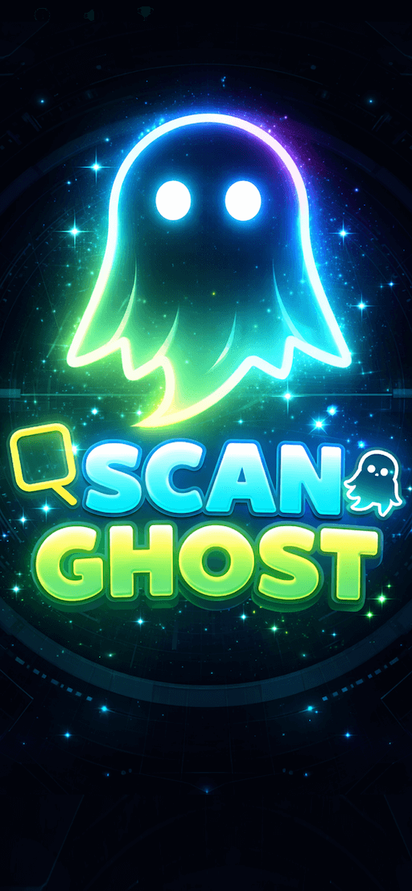
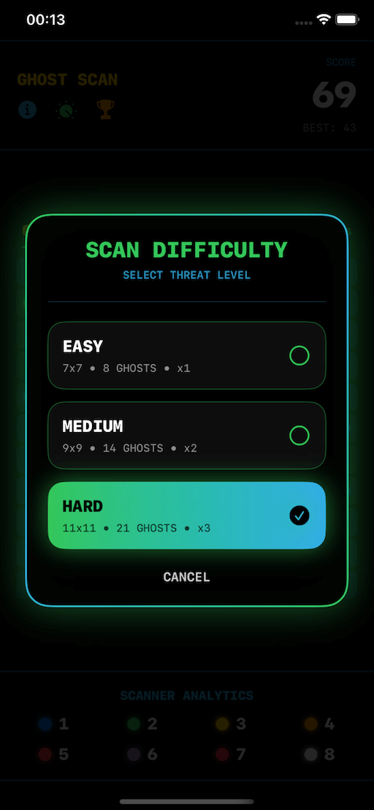
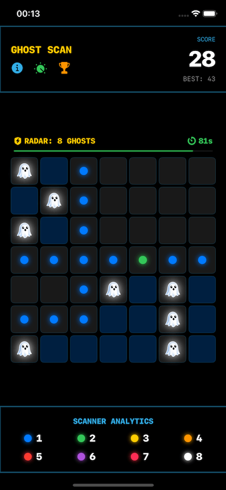

# 👻 Ghost Scan: Color Puzzle  

**A fast-paced logic puzzle where colors replace numbers and ghosts hide in plain sight.**  
Can you think faster than the clock?

---

## 🎮 About the Game

**Ghost Scan: Color Puzzle** is a modern, addictive logic puzzle that blends deduction, speed, and strategy.  
Instead of numbers, **colors reveal how many ghosts are nearby**, pushing players to rely on pattern recognition and critical thinking.

You must **scan the board in just 90 seconds**, uncover safe tiles, avoid hidden ghosts, and clear the grid before time runs out.

---

## ⚡ Core Features

- 🧠 **No numbers — only colors**: A fresh twist on classic logic puzzles  
- ⏱ **90-second time limit**: Pressure-driven gameplay  
- 🏆 **Global Leaderboards** via Apple Game Center  
- 🎯 **Multiple difficulty levels** for beginners to puzzle masters  
- 🌈 **Clean, colorful visual style** with a sci-fi mystery theme  
- 🔁 **Highly replayable** with randomized boards  

---

## 🖼 Screenshots

---

## 🚀 Download Now

---

## 🎯 Gameplay Challenge

> *“Scan fast. Think smarter. Survive the ghosts.”*

- Reveal safe tiles using color clues  
- Avoid hidden ghosts  
- Race against the clock  
- Master every difficulty level  

---

## 🛠 Built With

- **Game Engine:** Unity  
- **Platforms:** iOS & Android  
- **Leaderboard:** Apple Game Center  

---

## 📬 Contact

If you have feedback, suggestions, or collaboration ideas, feel free to reach out!

---

⭐ If you enjoy the game, please leave a review on the App Store or Google Play!
